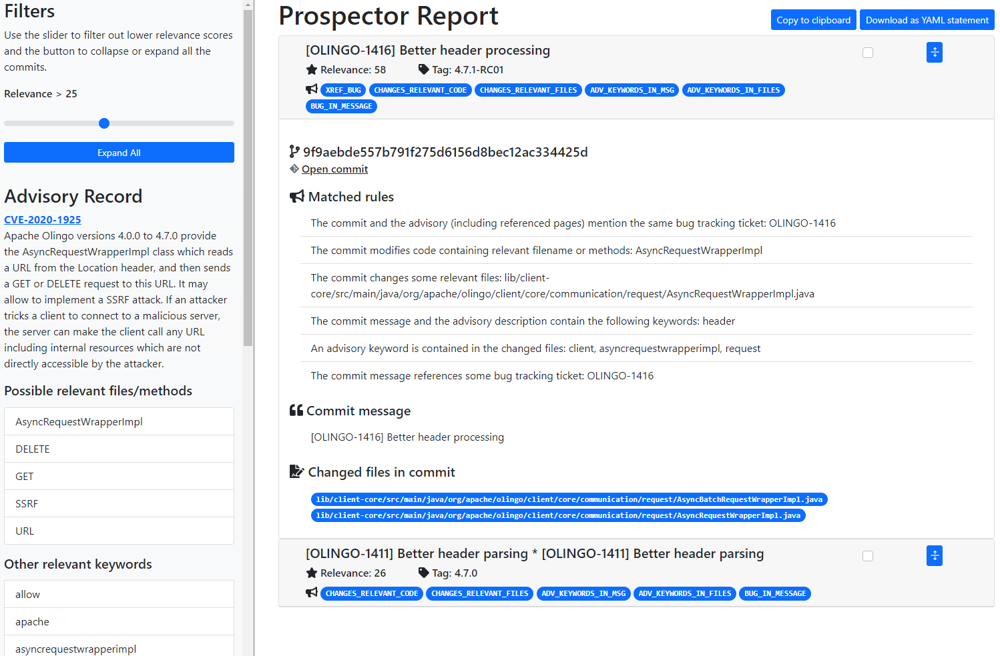

# Prospector

???+ note
    Prospector is a research prototype,
    currently under development: the instructions below are intended for development, testing and demonstration purposes only!

    Please note that **Windows is not supported** while WSL and WSL2 are fine.

Prospector is a tool to reduce the effort needed to find security fixes for
*known* vulnerabilities in open source software repositories.

Given an advisory expressed in natural language, Prospector processes the commits found in the target source code repository, ranks them based on a set of predefined rules, and produces a report that the user can inspect to determine which commits to retain as the actual fix.

## Setup & Run

???+ warning
    The tool requires Docker and Docker-compose, as it employes Docker containers for certain functionalities. Make sure you have Docker installed and running before proceeding with the setup and usage of Prospector.

To quickly set up Prospector:

1. Clone the project KB repository
```
git clone https://github.com/sap/project-kb
```
2. Navigate to the *prospector* folder
```
cd project-kb/prospector
```

3. Execute the bash script *run_prospector.sh* specifying the *-h* flag. This will display a list of options that you can use to customize the execution of Prospector.
```
./run_prospector.sh -h
```
The bash script builds and starts the required Docker containers. Once the building step is completed, the script will show the list of available options.


| Option                                                                                      | Description                                                                               |
| ------------------------------------------------------------------------------------------- | ----------------------------------------------------------------------------------------- |
| `vuln_id`                                                                                   | ID of the vulnerability to analyze                                                        |
| `-h`, `--help`                                                                              | Show help message and exit                                                                |
| `--repository REPOSITORY`                                                                   | Git repository URL                                                                        |
| `--preprocess-only`                                                                         | Perform commit preprocessing only                                                         |
| `--pub-date PUB_DATE`                                                                       | Publication date of the advisory                                                          |
| `--description DESCRIPTION`                                                                 | Advisory description                                                                      |
| `--max-candidates MAX_CANDIDATES`                                                           | Maximum number of candidates to consider                                                  |
| `--version-interval VERSION_INTERVAL`                                                       | Version or tag interval X:Y to consider                                                   |
| `--modified-files MODIFIED_FILES`                                                           | Names (or partial names) comma-separated that the commits are supposed to modify          |
| `--filter-extensions FILTER_EXTENSIONS`                                                     | Filter out commits that do not modify at least one file with this extension               |
| `--keywords KEYWORDS`                                                                       | Consider these specific keywords                                                          |
| `--use-nvd`, `--no-use-nvd`                                                                 | Get data from NVD or not                                                                  |
| `--fetch-references`                                                                        | Fetch content of references linked from the advisory                                      |
| `--backend BACKEND`                                                                         | URL of the backend server                                                                 |
| `--use-backend {always,never,optional}`                                                     | Use the backend server or not                                                             |
| `--report {html,json,console,all}`                                                          | Format of the report (options: console, json, html, all)                                  |
| `--report-filename REPORT_FILENAME`                                                         | File to save the report                                                                   |
| `-c CONFIG`, `--config CONFIG`                                                              | Configuration file                                                                        |
| `-p`, `--ping`                                                                              | Ping the server to check if it's online                                                   |
| `-l {DEBUG,INFO,WARNING,ERROR,CRITICAL}`, `--log-level {DEBUG,INFO,WARNING,ERROR,CRITICAL}` | Set the logging level                                                                     |
| `--ignore-refs IGNORE_REFS`                                                                 | Whether to ignore the fact that the fixing commit is reachable directly from the advisory |


1. Try the following example:
```
./run_prospector.sh CVE-2020-1925 --repository https://github.com/apache/olingo-odata4
```

By default, Prospector saves the results in a HTML file named *prospector-report.html*.

???+ success
    Open the *prospector-report.html* file in a web browser to view what Prospector was able to find!

<figure markdown>
  { width="600" }
  <figcaption>Prospector Report for CVE-2020-1925</figcaption>
</figure>

## Tool Demostration

### Video Recording
<iframe width="560" height="315" src="https://www.youtube.com/<IDHERE>" frameborder="0" allowfullscreen></iframe>

A video recording of the tool demo is also available [here](https://zenodo.org/record/7974442)

The steps shown in the video are the following:

1. Cloning the [project “KB”](https://github.com/SAP/project-kb) GitHub repository
2.  Execution of the script *run_prospector.sh* from the *prospector* subfolder. The script automatically builds and starts all the necessary docker containers
3.  The command line flags are shown on the screen; for the demo, we use the strictly
required inputs only, which are: *(A)* a vulnerability identifier and *(B)* the URL of the source code
repository of the project affected by the vulnerability
1. As illustrative example, Prospector is executed on *CVE-2020-1925* and the *Apache Olingo*
repository. As the tool runs, we give a high-level explanation of the processing it performs
(advisory record extraction, candidate commits retrieval and processing, rule application, report
generation).
1. The report generated at the end of the previous step is shown and its key elements are
described.
1. We highlight the fact that the advisory content is processed to extract important tokens
(keywords, file names, etc.).
1. We explain that commits are ranked by their relevance, which is computed by applying a
set of rules to each of them. The sum of the weights of the rules that match a commit determine
its relevance. The list of commits shown in the report can be filtered by a applying a relevance
threshold using a slider.
1. As a concrete example, we point out that the tool detected that the first commit in the list
modifies a class that is mentioned in the textual description of the advisory.

## Contributing
* [How to contribute](contributing.md)
