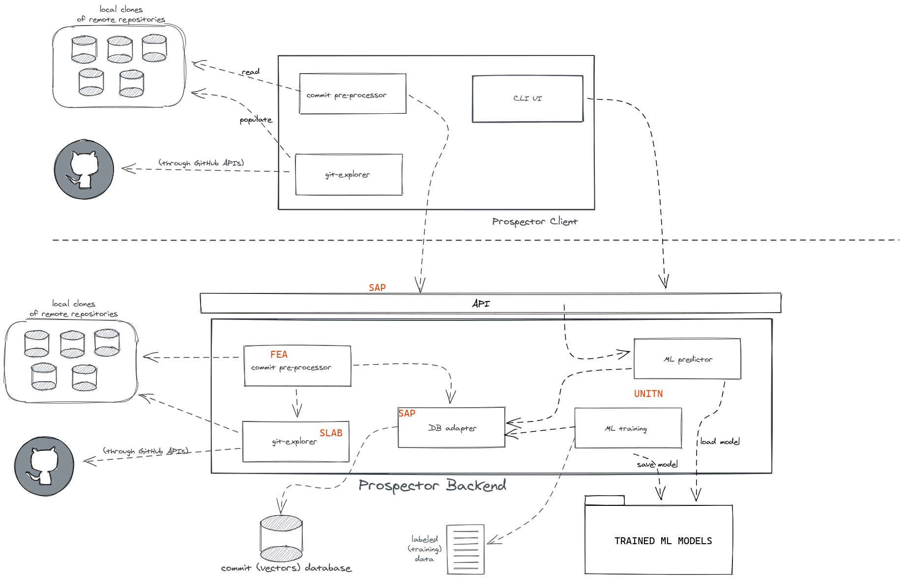

# Prospector

Prospector is a tool to reduce the effort needed to find security fixes for
*known* vulnerabilities in open source software repositories.

It takes a vulnerability description (in natural language) in input and
produces in output a ranked list of commits, in decreasing order of relevance.





**WARNING** Please keep in mind that Prospector is a research prototype, currently
under development: feel free to try it out, but do expect some rough edges.

If you find an bug, please open an issue. I you can also fix the bug, please
create a pull request (make sure it includes a test case that passes with your correction
but fails without it)

## Setup (for development and demonstration purposes only!)

The easiest way to set up Prospector is to clone this repository and then run the following commands:

```
git clone https://github.com/sap/project-kb
git checkout prospector-assuremoss
cd project-kb/prospector
cp .env-sample .env
```

Modify the `.env` file as you see fit, then continue with:

```
source .env
mkdir -p $GIT_CACHE
pipenv --python 3.8
pipenv install --dev
pre-commit install
python -m spacy download en_core_web_sm
```

This is necessary only the first time you set up your dev. environment.
Afterwards, you will just have to remember to activate the environment
with `pipenv shell`.

If at any time you wish to remove the virtual environment and create it from scratch
(for example, because you want to use a different version of the python interpreter),
just do `pipenv --rm` and the repeat the steps above.

If you have issues with these steps, please open a Github issue and
explain in detail what you did and what unexpected behaviour you observed
(also indicate your operating system and Python version).

*Please note that Windows is not supported*, WSL should be fine though.


**IMPORTANT**: this project adopts `black` for code formatting. You may want to configure
your editor so that autoformatting is enforced "on save". The pre-commit hook ensures that
black is run prior to committing anyway, but the auto-formatting might save you some time
and avoid frustration.

If you use VScode, this can be achieved by pasting these lines in your configuration file:

```
    "python.formatting.provider": "black",
    "editor.formatOnSave": true,
```

## Starting the backend database and the job workers

THIS STEP IS OPTIONAL: if the client is invoked but the backend is not running,
you will just get a warning and miss out on opportunities to have faster response times
if you make multiple queries. If you only intend to try out the client, feel free to skip
this section and the next and go straight to "Using the CLI".

Note: this section and the following assume you have performed succesfully the
steps in the *setup* section above.

This is achieved with docker and docker-compose, make sure you have both installed
and working before proceeding.

You can then start the necessary containers with the following command:

`docker-compose up -d --build`

This also starts a convenient DB administration tool at http://localhost:8080

## Starting the RESTful server

`uvicorn api.main:app --reload`

You can then point your browser to `http://127.0.0.1:8000` to access the API.
You might also want to take a look at `http://127.0.0.1:8000/docs`.

*Alternatively*, you can execute the RESTful server explicitly with:

`python api/main.py`

which is equivalent but more convenient for debugging.

## Using the CLI

Try the following example:

`python client/cli/main.py CVE-2014-0050 --repository https://github.com/apache/commons-fileupload --use-nvd`

or, specifying the tag interval to restrict the retrieval of candidate commits:

`python client/cli/main.py CVE-2014-0050 --repository https://github.com/apache/commons-fileupload --use-nvd --tag-interval FILEUPLOAD_1_3:FILEUPLOAD_1_3_1`

In the example above, the tag interval has been chosen by considering the text of the advisory ("MultipartStream.java in Apache Commons FileUpload before 1.3.1 [...]") and comparing it with the set of tags found  in the git repository.

*HEADS-UP*: Prospector has the capability to "guess" tag names from version intervals, but that functionality is not yet exposed to the command line client (it will be in the future). If you are curious to know how that works, please see the last page of [this paper](https://arxiv.org/pdf/2103.13375).

## Testing

To run the tests, run:

`pytest`

## Credits

This project was initially developed by Daan Hommersom as part of his thesis
done in partial fulfillment of the requirements for the degree of Master of
Science in Data Science & Entrepreneurship at the Jheronimus Academy of Data
Science during a graduation internship at SAP.

The original code developed by Daan Hommersom [can be retrieved
here](https://github.com/SAP/project-kb/releases/tag/DAAN_HOMMERSOM_THESIS).
