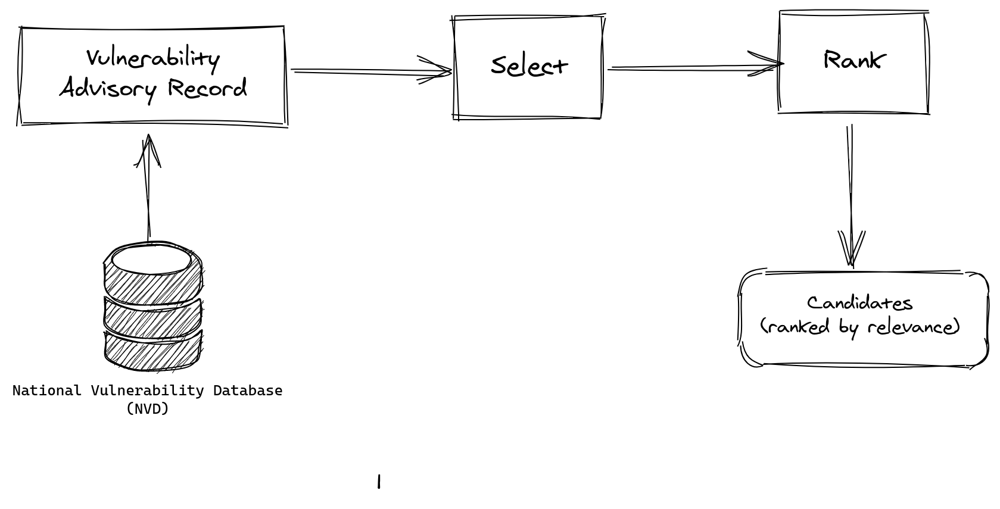

# Prospector

Prospector is a tool to reduce the effort needed to find security fixes for
*known* vulnerabilities in open source software. 





**WARNING** Please keep in mind that Prospector is a research prototype, currently
under development: feel free to try it out, but do expect some rough edges.

If you find an bug, please open an issue. I you can also fix the bug, please
create a pull request (make sure it includes a test case that passes with your correction
but fails without it)

## Setup

The easiest way to set up Prospector is to clone this repository and then run the following commands:

```
git clone https://github.com/sap/project-kb
cd project-kb/prospector
echo "GIT_CACHE=/tmp/git-cache" > .env
mkdir /tmp/git-cache
pipenv shell
pipenv install
python -m spacy download en_core_web_sm
```

If you have issues with the above commands, please open a Github issue and
explain in detail what you did and what unexpected behaviour you observed.
Please also indicate your operating system and Python version.

*Please note that Windows is not supported.*

## Use

`python main.py <vulnerability_id> -r <repository_url> -v`

For vulnerabilities that are in the NVD (CVEs), you only need to provide the CVE
and the URL of the repository that is affected. For vulnerabilities that are not
in the NVD, you will need to provide additional information. Furthermore, you
can provide all values manually to improve the prediction.

The repository also contains a streamlit-based graphical UI, but it is not maintained
and will be discontinued.

### Database & git-explorer

Prospector uses a SQLite database to store commit content. When providing a
vulnerability that affects a repository that is not in your database yet, the
extraction of this content can take a while (approximately 1000 commits/hour).

## Credits

This project was initially developed by Daan Hommersom as part of his thesis
done in partial fulfillment of the requirements for the degree of Master of
Science in Data Science & Entrepreneurship at the Jheronimus Academy of Data
Science during a graduation internship at SAP.

The original code developed by Daan Hommersom [can be retrieved
here](https://github.com/SAP/project-kb/releases/tag/DAAN_HOMMERSOM_THESIS).
