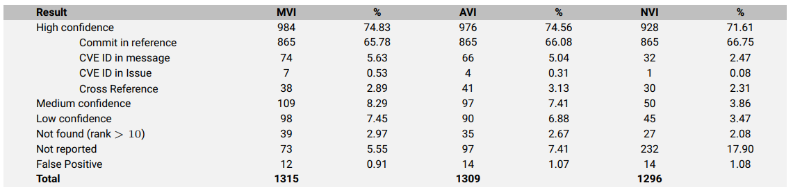

# Evaluate Prospector

This folder contains the scripts used for evaluating Prospector's reports and data needed for it (created and used in Summer 2024). The folder is structured as follows:

1. **Data** folder: contains input data, Prospector reports and results of the analysis of the Prospector reports.
2. **Scripts**: The scripts used for running Prospector on a batch of CVEs, and for analysing the created reports.

Prospector is run in the following way in this evaluation:

First, the five docker containers must be started with `make docker-setup` or manually with `docker` commands. Once they are running, `docker ps` should show the following:

```bash
CONTAINER ID   IMAGE                COMMAND                  CREATED          STATUS          PORTS                                       NAMES
c73aed108475   prospector_backend   "python ./service/ma…"   47 minutes ago   Up 47 minutes   0.0.0.0:8000->8000/tcp, :::8000->8000/tcp   prospector_backend_1
2e9da86b09a8   prospector_worker    "/usr/local/bin/star…"   47 minutes ago   Up 47 minutes                                               prospector_worker_1
b219fd6219ed   adminer              "entrypoint.sh php -…"   47 minutes ago   Up 47 minutes   0.0.0.0:8080->8080/tcp, :::8080->8080/tcp   prospector_adminer_1
9aacdc04f7c5   postgres             "docker-entrypoint.s…"   47 minutes ago   Up 47 minutes   0.0.0.0:5432->5432/tcp, :::5432->5432/tcp   db
7c540450ab76   redis:alpine         "docker-entrypoint.s…"   47 minutes ago   Up 47 minutes   0.0.0.0:6379->6379/tcp, :::6379->6379/tcp   prospector_redis_1
```

[`dispatch_jobs.py`](#running-prospector-on-multiple-cves-dispatch_jobspy) creates jobs with the `prospector()` function in them and enqueues
them in a Redis Queue, from which the `prospector_worker` container fetches jobs and executes them. To visualise what is going on, run
`docker attach prospector_worker_1` to see the usual console output. In order to change something inside the container, run `docker exec -it prospector_worker_1 bash` to open an interactive bash shell.

You can set the number of workers in `docker/worker/etc_supervisor_confd_rqworker.conf.j2`.

## Configuration File

The configuration file has two parts to it: a main part and a Prospector settings part, which is a copy of a part of the original Prospector `config.yaml` file.

The main part at the top allows you to set the path to where the input data can be found, where Prospector reports should be saved to and where analysis results should be saved to.

The Prospector part allows you to set the settings for Prospector (independent from the Prospector settings used when running Prospector with `./run_prospector`). **Watch out**: Since the `prospector_worker` container is created in the beginning with the current state of the `config.yaml`, simply saving any changes in `config.yaml` and dispatching new jobs will still run them with the old configuration. For new configuration parameters to take effect, either destroy the containers with `make docker-clean` and rebuild them with `make docker-setup` or open an interactive shell to the container and make your changes to the code in there.

## Script Files explained

### Running Prospector on multiple CVEs (`dispatch_jobs.py`)

The code for running Prospector is in `dispatch_jobs.py`. It exctracts CVE IDs from the data given in the path constructed as: `input_data_path` + the `-i` CL parameter. It then dispatches a job for each CVE ID to the queue, from where these jobs get executed. The path to the input file is split into two components (`input_data_path` in `config.yaml` and the `-i` parameter) because you might have one folder in which you have several different input data files of the same format. This keeps you from typing the full path, but still allows you to switch between the files between different runs.

The reports are generated in the worker container, and saved to `prospector_reports_path_container`. This folder is mounted into the container, so you can see any newly generated reports in the same folder on the host.

Do not confuse this paramter with `prospector_reports_path_host`, which sets the path to a batch of reports on the host (used for analysis). Your workflow should be as follows:

1. Dispatch reports
2. When the report generation has finished, move the reports to any other folder (preferably outside of the `prospector/` folder to keep the build context for the container from getting too big).
3. Analyse the reports by setting the `prospector_reports_path_host` to the folder where you moved the reports to.

### Analysing the generated reports (`analyse.py`)

Start an analysis with

```bash
python3 evaluation/main.py -i <your_input_data_csv_file> -a
```

This will start the `analyse_prospector_reports()` function in `analyse.py`, which re-creates the summary execution table from [AssureMOSS D6.3](https://assuremoss.eu/en/resources/Deliverables/D6.3):


It also creates a detailed JSON file (listing CVEs in each category) in `data/results/summary_execution/` to inspect which CVEs are in which category.